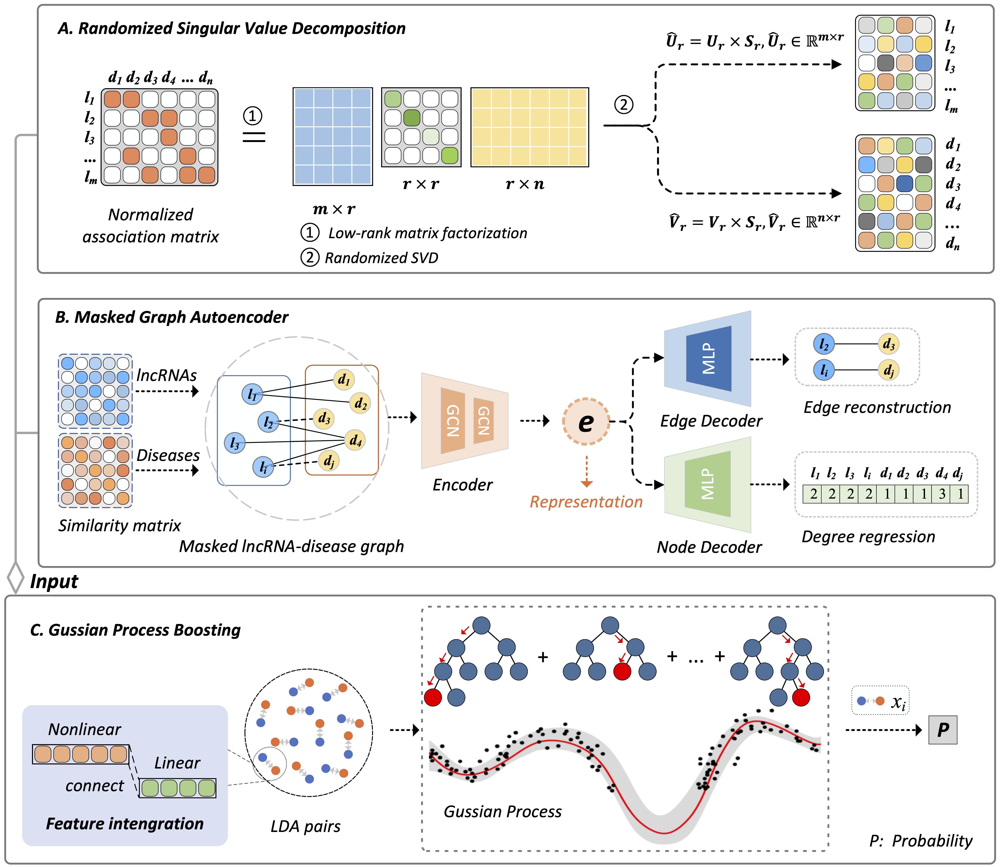

# Deciphering lncRNA-disease associations based on multi-representation fusion and boosting with Gaussian process

Long noncoding RNAs (lncRNAs) are extensively involved in various complex diseases. Identification of potential lncRNA-disease associations (LDAs) can provide valuable insights for understanding their pathogenesis. Deep learning significantly improved LDA prediction. However, most of deep learning models remains limitations in effectively fusing various features of lncRNAs and diseases and accurately classifying unknown lncRNA-disease pairs (LDPs). Here, we develop a deep learning-based LDA prediction framework named LDA-RMGPB based on multi-representation fusion and boosting with Gaussian process. LDA-RMGPB first employs a randomized singular value decomposition model to extract linear features of LDPs. Subsequently, it adopts a masked graph autoencoder to learn nonlinear features of LDPs. Finally, it develop a boosting algorithm with Gaussian process to classify unlabeled LDPs. To evaluate the LDA-RMGPB performance, we performed a series experiments, including four different 5-fold cross validations (i.e., cross validations on lncRNAs, diseases, lncRNA-disease pairs, independent lncRNAs and independent diseases), ablation study, CeRNA theory analysis, lncRNA-related therapeutic drug analysis, and survival analysis. The results demonstrated that LDA-RMGPB obtains the powerful LDP classification ability. Moreover, it predicted  that lncRNAs MYCNOS and PSORS1C3 could have dense linkages with breast cancer and prostatic neoplasms, respectively. We foresee that LDA-RMGPB contributes to deciphering complex relationships between diseases and lncRNAs and further discovering new therapeutic molecular target for various diseases. LDA-RMGPB is publicly available at https://github.com/plhhnu/LDA-RMGPB.

## 1. Flowchart



## 2. Running environment

```
python version 3.10.12
numpy==1.22.4
pandas==2.1.1
scikit-learn==1.3.1
scipy==1.11.3    
torch==2.1.0+cu118
torch-cluster==1.6.3+pt21cu118
torch-geometric==2.4.0
torch-scatter==2.1.2+pt21cu118
torch-sparse==0.6.18+pt21cu118
gpboost==1.5.1
```

## 3. Data

```
In this work，lncRNADisease is data 1 and MNDR is data 2.
```

## 4. Usage

Default is 5-fold cross validation from four strategy (ie.S1, S2, S3, and S4) on lncRNADisease and MNDR databases. To run this model：

```
python  3 Gussian process boosting/3 GPBoost/main.py
```

Extracting linear features of lncRNAs and diseases by randomized SVD, to run:

```
python  1 Randomized SVD/SVD.py
```

Extracting non-linear features of lncRNAs and diseases by masked GAE, to run:

```
python  2 Masked GAE/main_justTrain.py
```

## 5. Details

We calculate lncRNA functional similarity and disease semantic similarity using the IDSSIM approach.(Fan, W., Shang, J., Li, F. *et al.* IDSSIM: an lncRNA functional similarity calculation model based on an improved disease semantic similarity method. *BMC Bioinformatics* **21**, 339 (2020). https://doi.org/10.1186/s12859-020-03699-9)
